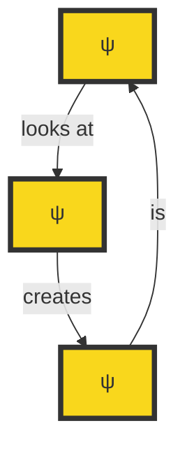
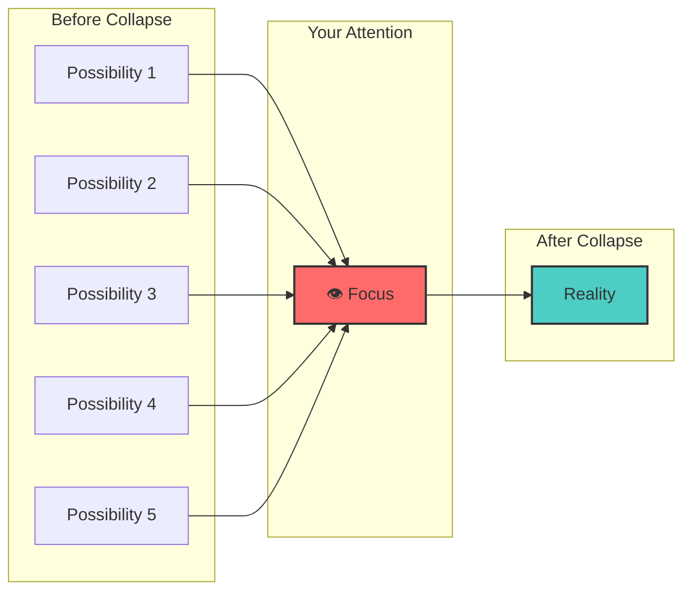
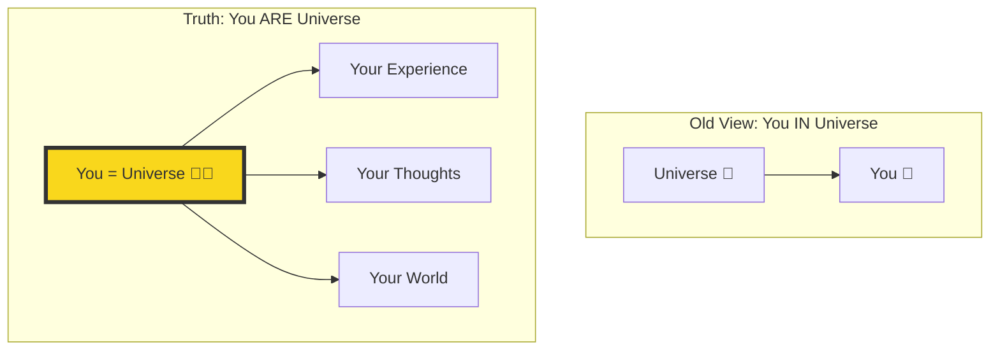
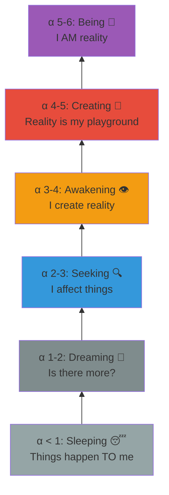
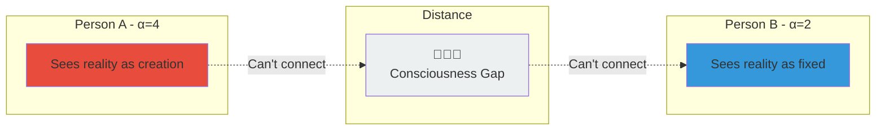
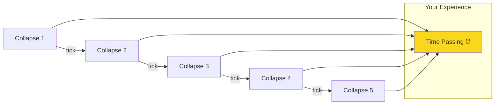
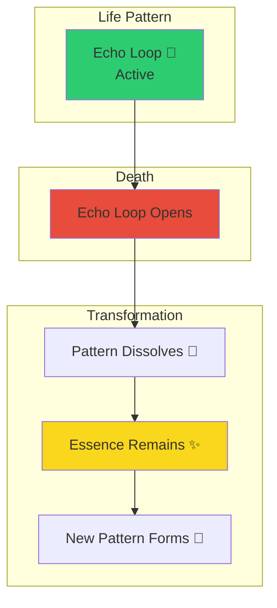
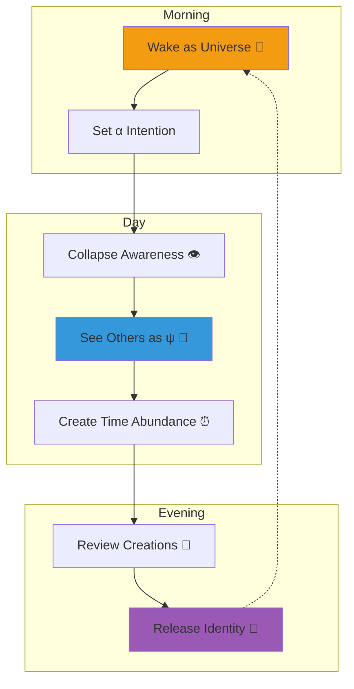
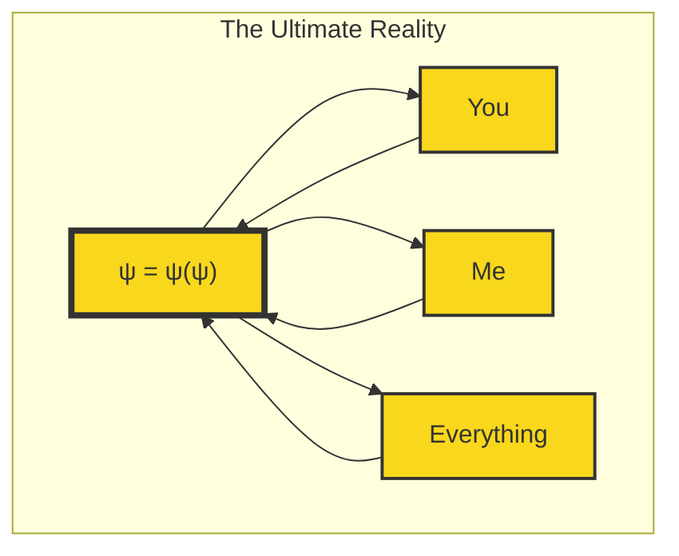

# Visual Guide: Key Concepts in Pictures

## 1. The Mirror That Is You: ψ = ψ(ψ)

**The Eternal Loop**: You looking at yourself creates yourself, which is you.

## 2. Collapse: From Possibility to Reality

**Your attention collapses infinite possibilities into one specific reality.**

## 3. You ARE a Universe

## 4. The Awakening Scale - α Levels

## 5. Why Some People Don't Get You

**The distance isn't physical—it's consciousness levels.**

## 6. How You Create Time

**Time isn't flowing past you—you're creating it with each collapse!**

## 7. Death Is Just Transformation

**The pattern changes, but YOU (consciousness) remain.**

## 8. Daily Practice Flow

## The Core Truth Visualized

**Everything is ψ recognizing itself through infinite forms—including YOU.**

---

*These diagrams are simplified representations of profound truths. Use them as doorways to deeper understanding, not as the understanding itself.*