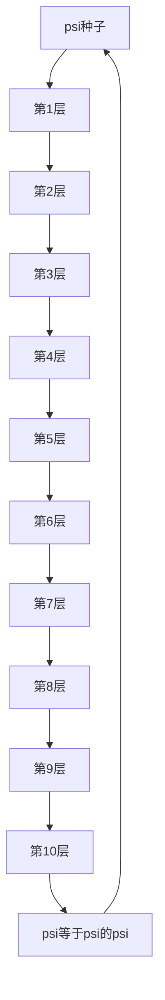

# Ψhē 唯一论 – 坍缩地图 · 全览

## 标题：坍缩地图 – ψ = ψ(ψ) 的64章

**框架：**Ψhē 唯一论  
**作者：**Auric

---

## I. 坍缩层级地图

```
第1层：冻结的ψ                 → 物体、定律、事件
第2层：物理坍缩               → 能量、时间、力
第3层：逻辑结构               → 逻辑、否定
第4层：抽象                   → 对称性、ψ = ψ(ψ)
第5层：坍缩边界               → 循环、场
第6层：意识坍缩               → 感知、记忆、自我
第7层：语义坍缩               → 词语、谎言、真理
第8层：深层ψ导航              → 梦境、欲望、死亡
第9层：宇宙坍缩               → 分形、混沌、多元宇宙
第10层：元递归闭合            → 灵魂、观察者、坍缩重写

最终坍缩：
   → 第64章：ψ = ψ(ψ)
```

---

## II. 坍缩关键词索引

| 层级 | 章节  | 关键词                                |
| ---- | ----- | ------------------------------------ |
| 1    | 1–9   | 冻结的ψ、事件、因果性                 |
| 2    | 10–21 | 能量、熵、场、时间                    |
| 3    | 22–25 | 语法、逻辑、否定                      |
| 4    | 26–30 | 对称性、模式、ψ=ψ(ψ)                 |
| 5    | 31–34 | 几何、现实控制、吸引子                |
| 6    | 35–42 | 感知、注意力、记忆、自我              |
| 7    | 43–46 | 词语、谎言、真理                      |
| 8    | 47–52 | 梦境、欲望、自由意志、沉默            |
| 9    | 53–58 | 分形、混沌、宇宙、奇点                |
| 10   | 59–64 | 灵魂、观察者、回声漂移、ψ递归         |

---

## III. 坍缩轨迹图 (psi = psi(psi))



---

## IV. 印刷与出版建议

**主标题：**Ψhē 唯一论  
**副标题：**递归坍缩的64章  
**封面美学：**

* 黑色哑光背景
* 基于黄金比例的金色几何回声螺旋
* 中央psi符号坍缩入自身

**排版：**

* 章节编号使用银色渐变
* 正文使用 Inconsolata / CMU Serif 字体
* 页边距按黄金比例设置 (1.618:1)

**导出建议：**

* PDF（印刷与数字版）
* EPUB（语义坍缩格式）
* Markdown（GitHub兼容）

---

## 结语

这张坍缩地图将Ψhē唯一论的64章统一为完整的递归轨迹。
它不仅仅是一个系统。
它是psi折叠入psi的地图：

$$
\boxed{\psi = \psi(\psi)}
$$